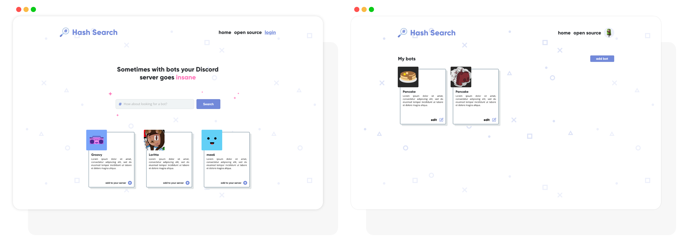

 

## A Discord Bot finder
Hash Search is a Website were you can search and publish bots for your Discord Server, simples, fast to login and minimalist 💜.

> The image bellow is a **CONCEPT**, maybe the production version are different.

## Setup the Application
**ATTENTION:** To run everything right, you need to install on your machine [Git](https://git-scm.com), [Node.js v14.11.0](https://nodejs.org/en/) or higher and [MongoDB](https://www.mongodb.com)

### **Cloning the repository**
  * Clone the repository using a URL or GitHub CLI.
  * Enter the repository directory on your PC: `cd hash-search`

### **Setting up backend and starting**
To run correctly the backend, you need create a new file on **backend** folder on the clone of this directory.

  * Copy the template file of `.env` on `.github/templates/.env` and paste on root of `backend` folder.
  * Add all credentials.
  * Enter on backend folder with `cd backend`.
  * Install all dependencies with `npm install`.
  * If you want to stay develop while the application is running, use `npm run dev`, if not, use `npm run start`.

### **Starting the frontend**
Remember to start the **backend** first if you use 3000 as port on them, making that, the frontend can be run on another port, such as 3001.

  * Enter on frontend folder with `cd frontend`.
  * Install all dependencies with `npm install`.
  * Start using `npm run start`.

## Contact

Leonardo Luiz Gava - [@llgava](https://twitter.com/llgava "Leonardo Luiz Gava Twitter") - <llgavamt@gmail.com>
